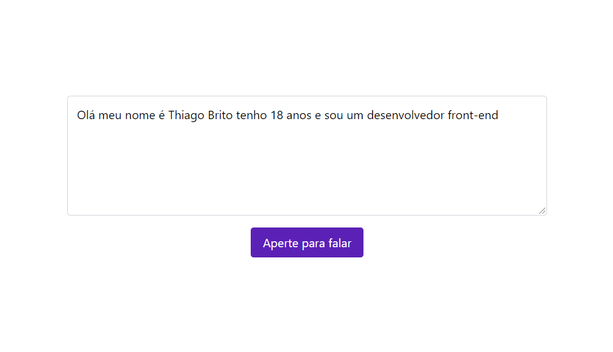

  

## About the component

  The component in question consists of two elements, the first is a text box that will receive, through the Speech Recognition API, the transcription, in real time, of everything the user says; and the second is a button that, when clicked for the first time, will make a call to the "start" method, present in an instance of the Speech Recognition object, which in turn is the value of a property of the "window" object. which will cause the entire flow of apprehension and conversion of the user's voice into text to occur until the user either stops talking or presses the button again, which, in this case, will make a call to the "stop" method, also present in the instance of the Speech Recognition object, which will stop said flow.

## README versions

  <a href="https://github.com/ThiagoBrito-Dev/playing-with-speech-recognition-api/blob/main/README.md">
    Portuguese (pt-br)</a>
  |   
  <a href="https://github.com/ThiagoBrito-Dev/playing-with-speech-recognition-api/blob/main/README-en.md">
    English (en-us)</a>

