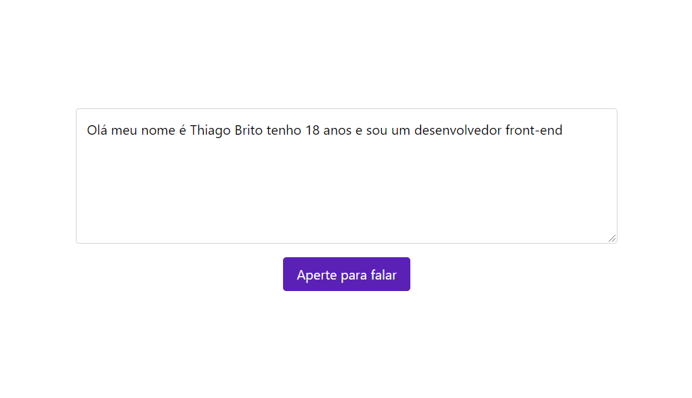

  

## Sobre o componente

  O componente em questão consiste em um dois elementos, o primeiro é uma text box que vai receber, por meio da API de reconhecimento de fala (Speech Recognition), a transcrição, em tempo real, de tudo o que o usuário disser; e o segundo, é um botão que, quando clicado pela primeira vez, realizará uma chamada para o método "start", presente em uma instância do objeto Speech Recognition, que por sua vez é o valor de uma propriedade do objeto "window", que fará com que todo o fluxo de apreensão e conversão da voz do usuário em texto ocorra até que o mesmo ou pare de falar ou aperte, novamente, o botão, o que, nesse caso, realizará uma chamada para o método "stop", também presente na instância do objeto Speech Recognition, que parará o referido fluxo.

## README versions

  <a href="https://github.com/trybrito/form-with-tailwind-and-google-forms/blob/main/README.md">
    Portuguese (pt-br)</a>
  |   
  <a href="https://github.com/trybrito/form-with-tailwind-and-google-forms/blob/main/README-en.md">
    English (en-us)</a>

